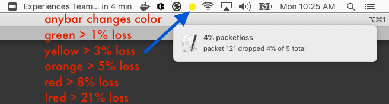

# notify-on-packetloss.sh

_Send a macos notification when packetloss is detected._



This creates a macos macos launchd service that runs a bash script checking for
packetloss by pinging your internet gateway. When packetloss is detected, it'll
send a macos notification and severity color to anybar, and log to the system log.


## Requirements

* Macos: High Sierra or greater.
* [Anybar](https://github.com/tonsky/AnyBar) (Optional, but works togther nicely)


## Installation

```bash
mkdir -p nop && \
  curl -#L https://github.com/0xadada/notify-on-packetloss/tarball/master | \
  tar -xzv -C nop --strip-components=1
cd nop
./install.sh
```


## Uninstallation

```bash
# remove the launchd service
launchctl remove pub.0xadada.notify-on-packetloss
# remove all associated files
rm \
  "${HOME}/bin/notify-on-packetloss.sh" \
  "${HOME}/Library/LaunchAgents/pub.0xadada.notify-on-packetloss.plist"
```
